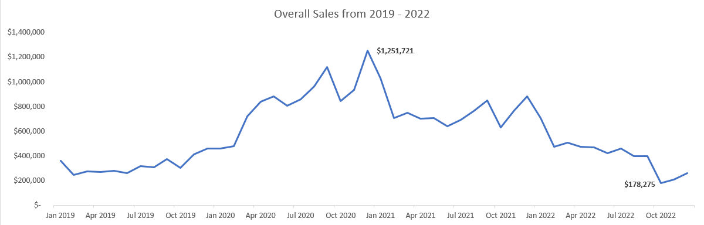
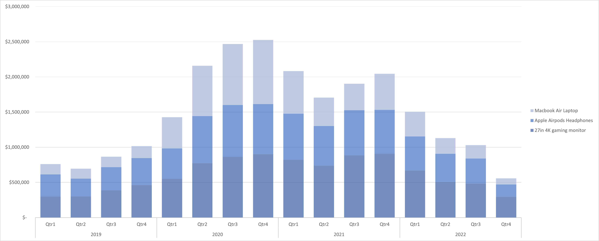
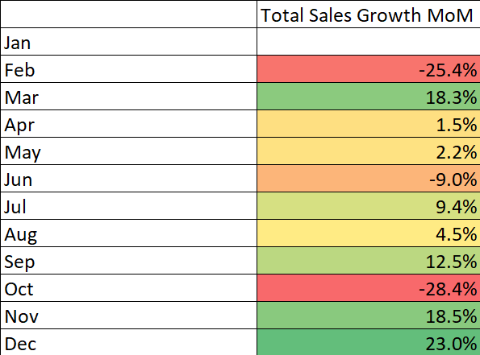
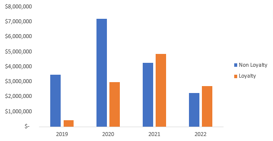

# TechLance_TechAnalysis

# Table of Contents
- [Background](#Background)
- [Executive Summary](#Executive-Summary)

# Background 
Founded in 2018, TechLance is an e-commerce electronics company that sells popular products from Apple, Samsung, and ThinkPad to an expanded global customer base. TechLance primarily sells its products through their online site as well as through their mobile app while uinge a variety of marketing channels to reach customers, including Email campaigns, SEO, and affiliate links. 

# Executive Summary

## Overall Sales Trends (2019-2022)

Total sales peaked in 2020 (**$10M**), achieving a **163% increase** in comparison to 2019 as a result of the COVID-19 pandemic. However, total revenue declined following a sharp decrease in Q1 2021, eventually reaching the least sales in 2022 (**$4.9M**), a **46% decrease** compared to the previous year.

### Insights Deep Dive

* The highest growth was reached in Q1 2020 ($1.6M) and Q2 2020 ($2.5M), peaking at **$880k** in May 2020 and may be attributed towards a rise in economy-wide spending. 

* Although 2020 was a strong year, **growth was not sustainable** and declined, following a sharp decrease in Jan 2021. 

* Sharp spikes likely reflect **stimulus-driven spending** rather than underlying business performance, as evidenced by their short-lived nature.

* Q4 2022 was the weakest quarter, with sales falling to **$600K**(-48% QoQ), **$300K below 2019 quarterly averages**. October hit a low of **$170K**, liekly reflecting operational or market-driven shifts.

## Product Insights

* During this time period, the **Apple Airpods Headphones and 27in gaming monitor** were the top products in both order count and total sales, making up **62.6% of total revenue** ($17.5M) and **66.4% of total number of orders** (71K).

* The **worst product** considerably was the **Bose Soundsport Headphones** with only 27 orders and contributing 0.01% of total revenue. 

* Despite having less than 7,000 total orders, **laptop products had the highest AOV** of over $1,000 for both the **Macbook Air Laptop and ThinkPad Laptop**, while also driving a third of total sales.

* Only 3 products have contributed towards **85% of total revenue** - 27in gaming monitor, Apple Airpods Headphones, and Macbook Air Laptop, which is almost **$24M**. 

## Seasonality 

* Q4 tends to be the most successful, namely **November and December**, most likely driven by a rise in holiday-driven purchasing behavior, averaging **~20% increase in total revenue MoM**

* However, **February and October seem to be the worst months**, with decreases of at least -25% in total revenue and -26% in number of orders.

* The summer months do not fluctuate significantly, though **September has the second highest number of orders on annual average**, behind December. 

## Loyalty Program

* 