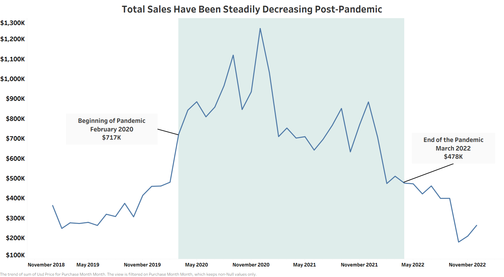
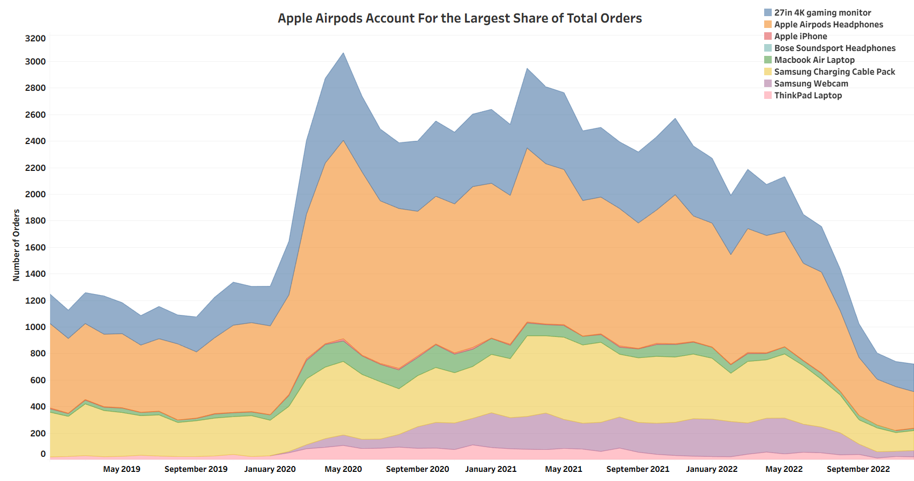
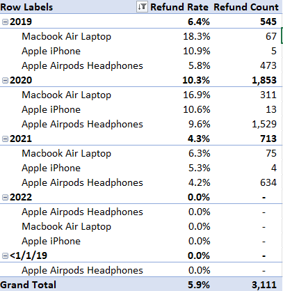

# TechLance Electronics Analysis

# Background 
Founded in 2018, TechLance is an e-commerce electronics company that sells popular products from Apple, Samsung, and ThinkPad to an expanded global customer base. TechLance primarily sells its products through their online site as well as through their mobile app while uinge a variety of marketing channels to reach customers, including Email campaigns, SEO, and affiliate links. 

# Executive Summary

## The Pandemic Impact

* **The Pandemic Period More Than Doubled Total Revenue**: Beginning March 2020 to January 2021, Total Revenue grew by **162.6% YoY** in 2020, peaking at **$10M** but **declined sharply as the pandemic was ending**.

* **Pandemic Driven Spending Brought Temporary Growth**: During the pandemic, revenue increased as **AOV rose by 30.7% and order count grew by 101%**. This growth was largely supported by **temporary shifts in customer behavior**, as consumers spent more time at home and had additional simulus-driven spending power.

* **Total sales have been decreasing steadily post-pandemic**: Since the later stages of the pandemic, total revenue has been decreasing an average of **-4% MoM**. Although current yearly sales are have increased by **$1M** compared to 2019, **2022 is down -46% YoY, a decrease of -$4M from 2021.**

* **Q4 2022 was the worst quarter in the past 3 years**: Revenue fell under $700K, down 32.9% vs. 2019 quarterly averages and 48% QoQ. A concerning decline that moves beyond post-pandemic correction, with **revenue now underperforming pre-pandemic benchmarks.**

## Product Insights

* **Apple Airpods are the most purchased product by a large margin**: From 2019-2022, Apple Airpods represented 44.7% of total products sold, totaling 48K units. In 2020, the product grew by 96% over the previous year but has since declined by -41.1% YoY in 2022.

* **Order Volume is Highly Concentrated On 3 Products**: Apple Airpods, 27in 4k gaming monitor, and Samsung Charging Cable Pack contribute towards 86.69% of order volume, accounting for over 93K units. **This suggests a heavy dependency and making them key drivers of demand, inventory management, and marketing focus.**

* **Lowest 2 Products Generated Minimal Demand**: The two least ordered products, **Apple iPhone** and **Bose Soundsport Headphones**, contributed minimal value to overall demand, accounting for a negligible **0.29% of total order volume** with just over **300 orders**. 

## Seasonality 

* **Q4 Leads Seasonally, Despite October Consistently Underperforming**: Despite November and December averaging 21% MoM growth and consistently driving Q4 as the stongest quarter, **October remains a recurring weakpoint**, averaging a -31% MoM decline and roughly a **-$200K loss in revenue.**

* **October 2022 Was the Lowest-Performing Month, aligning with the broader decline of 2022**: Although October consistently underperforms each year, October 2022 was the sharpest decline, **falling -55.2% MoM** and losing over -$200K. However, this appears consistent with broader 2022 declines, as January and February also declined by -$170K and -$230K, respectively. 

## Loyalty Program

* Non-loyalty members dominated early performance, peaking at 108% YoY growth in 2020 and generating **71% ($7.2M) of total revenue**. However, with a sharp decline in **February 2021 by -39%**, non-loyalty members began to decline in total revenue, eventually reaching **under $200K in Q4 2022**

* This pattern is also reflected in other metrics, where **AOV peaked at $345** and **order count reached 20,822 in 2020**. Both declined shortly thereafter, decreasing in AOV and order count by **-18% and -36%** respectively.

* Loyalty members, struggled initially but saw **rapid growth through 2019 and  the pandemic period**, increasing 614% YoY in 2020 and 64% in 2021. Despite a decline in 2022 by -44%, loyal members continue to **drive 55% of total revenue**.

* AOV for loyalty members are trending upwards, starting at $207 in 2019 and reaching $245 in 2022. However, order count has **declined to 11,107**, a 43% decrease from the previous year.

## Refund Rates 

* When looking at Apple products specifically, **the Macbook Air Laptop has the highest refund rate overall**, peaking at 18.3% in 2019, but decreasing on average 1.6% YoY. 

* Overall, **all apple products decreased in refund rate by at least 5% from 2020 to 2021**, with the Apple Airpods Headphones decreasing its refund count from 1,529 to 634. 

* In 2022, **the refund rate and refund count was 0% for all Apple products**, an anomaly which can be explained by **errors in data collection** rather than a sudden change in customer behavior, considering the decrease in total revenue and order count during the same year.

### 