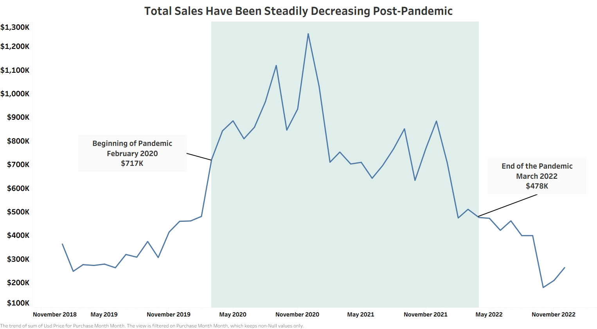
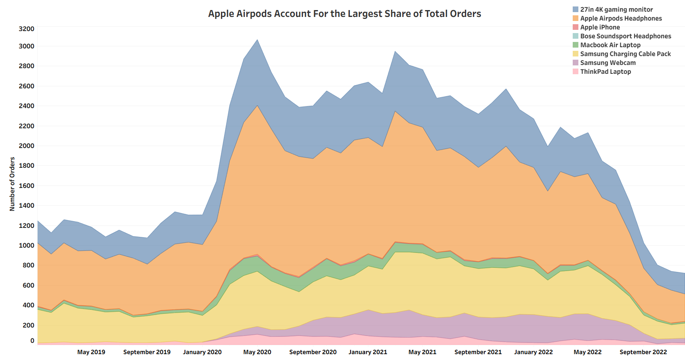
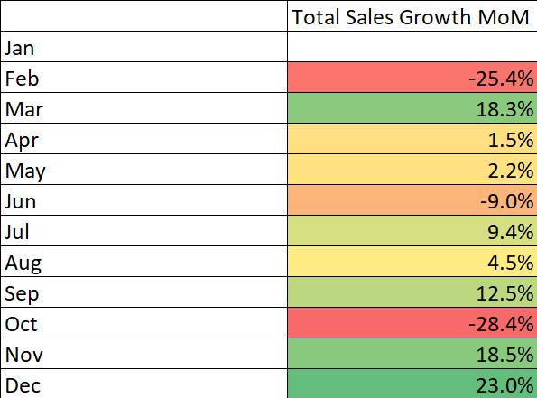
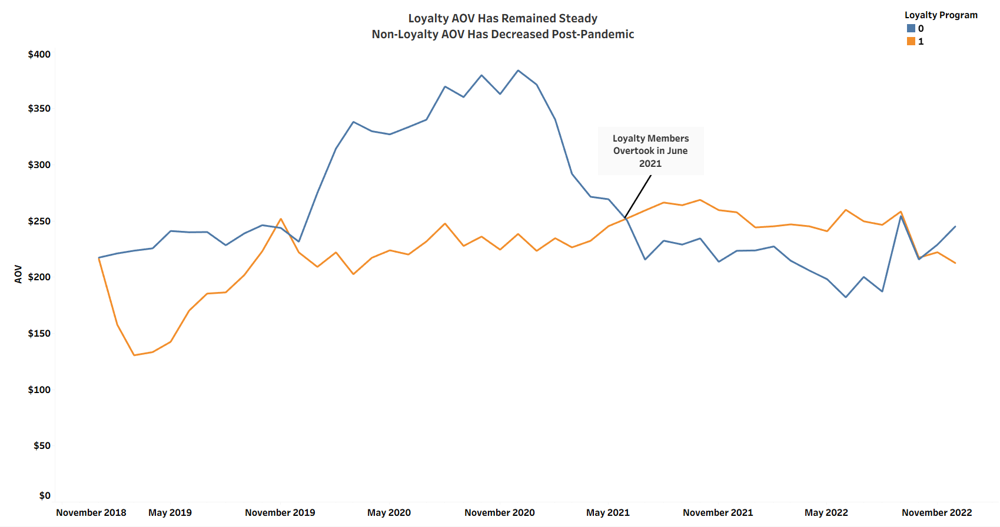
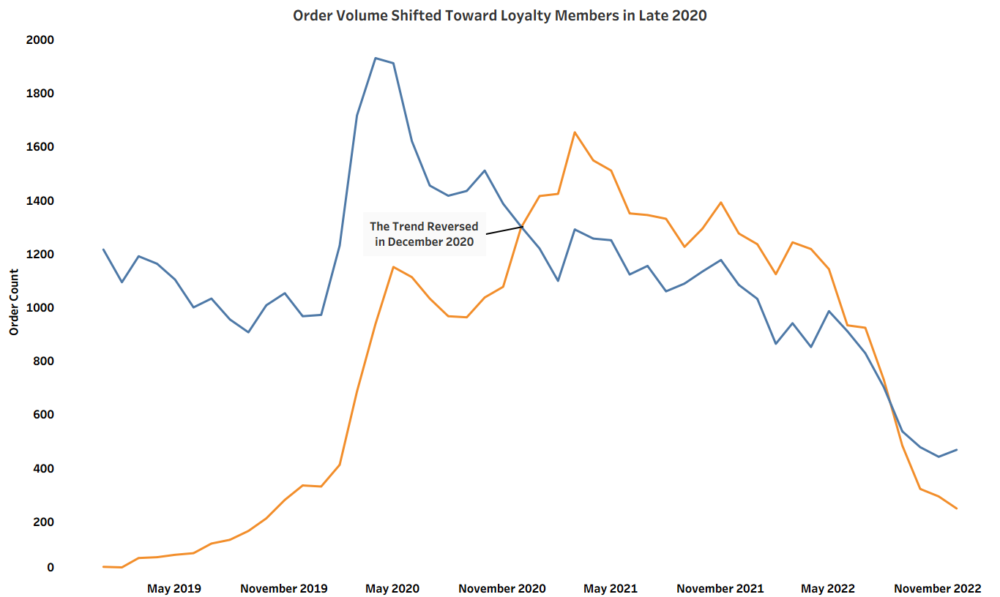
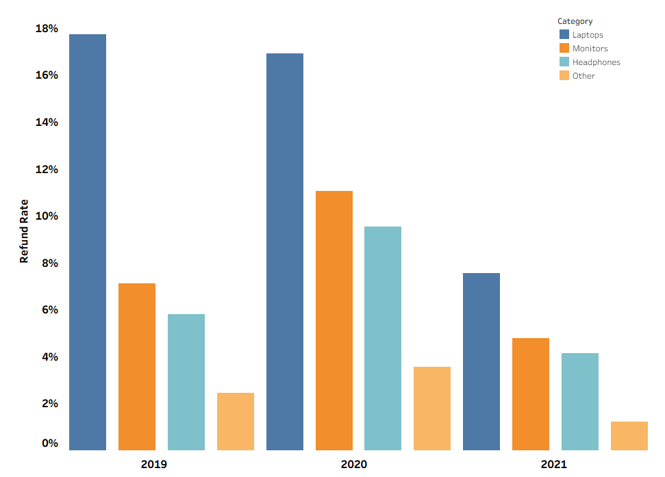

# TechLance Electronics Analysis

# Background 
Founded in 2018, TechLance is an e-commerce electronics company that sells popular products from Apple, Samsung, and ThinkPad to an expanded global customer base. TechLance primarily sells its products through their online site as well as through their mobile app while uinge a variety of marketing channels to reach customers, including Email campaigns, SEO, and affiliate links. 

# Executive Summary

## The Pandemic Impact

* **The Pandemic Period More Than Doubled Total Revenue**: Beginning March 2020 to January 2021, Total Revenue grew by **162.6% YoY** in 2020, peaking at **$10M** but **declined sharply as the pandemic was ending**.

* **Pandemic Driven Spending Brought Temporary Growth**: During the pandemic, revenue increased as **AOV rose by 30.7% and order count grew by 101%**. This growth was largely supported by **temporary shifts in customer behavior**, as consumers spent more time at home and had additional simulus-driven spending power.

* **Total sales have been decreasing steadily post-pandemic**: Since the later stages of the pandemic, total revenue has been decreasing an average of **-4% MoM**. Although current yearly sales are have increased by **$1M** compared to 2019, **2022 is down -46% YoY, a decrease of -$4M from 2021.**

* **Q4 2022 was the worst quarter in the past 3 years**: Revenue fell under $700K, down 32.9% vs. 2019 quarterly averages and 48% QoQ. A concerning decline that moves beyond post-pandemic correction, with **revenue now underperforming pre-pandemic benchmarks.**

## Product Insights

* **Apple Airpods are the most purchased product by a large margin**: From 2019-2022, Apple Airpods represented 44.7% of total products sold, totaling 48K units. In 2020, the product grew by 96% over the previous year but has since declined by -41.1% YoY in 2022.

* **Order Volume is Highly Concentrated On 3 Products**: Apple Airpods, 27in 4k gaming monitor, and Samsung Charging Cable Pack contribute towards 86.69% of order volume, accounting for over 93K units. **This suggests a heavy dependency and making them key drivers of demand, inventory management, and marketing focus.**

* **Lowest 2 Products Generated Minimal Demand**: The two least ordered products, **Apple iPhone** and **Bose Soundsport Headphones**, contributed minimal value to overall demand, accounting for a negligible **0.29% of total order volume** with just over **300 orders**. 

## Seasonality 

* **Q4 Leads Seasonally, Despite October Consistently Underperforming**: Despite November and December averaging 21% MoM growth and consistently driving Q4 as the stongest quarter, **October remains a recurring weakpoint**, averaging a -31% MoM decline and roughly a **-$200K loss in revenue.**

* **October 2022 Was the Lowest-Performing Month, aligning with the broader decline of 2022**: Although October consistently underperforms each year, October 2022 was the sharpest decline, **falling -55.2% MoM** and losing over -$200K. However, this appears consistent with broader 2022 declines, as January and February also declined by -$170K and -$230K, respectively. 

* **January and February Typically Underperform, But 2020 Was a Notable Exception**: Despite January and February declining an average of -2.2% in AOV, the pandemic period throughout 2020 was considerably strong at $275 AOV, averaging an increase of 12.8% MoM.

## Loyalty Program

  
  

<table>
    <tr>
        <td width="45%" valign="top" style="border: 1px solid white; padding: 16px;">

<strong> Loyalty Steady Growth</strong>
<ul>
    <li> Throughout 2019, loyalty members <strong> surged 93.8% </strong>, following the introduction of the program .</li>
    <li> Loyalty AOV has been gradually <strong> growing by 0.3% MoM </strong>, indicating a consistent increase in higher valued purchases. </li>
</ul>

<strong>Non-Loyalty AOV Faced Significant Decline </strong>
<ul>
    <li> In Q1 2020, non-loyalty AOV <strong> grew 46.3% to $338 </strong>, potentially driven by <strong> significant changes in customer behavior from the pandemic </strong> and maintained growth throughout 2020. </li>
    <li> Throughout 2021-2022, non-loyalty AOV <strong> fell sharply by -52.6% to $182 </strong>, once at its peak of $384 in December 2020, <strong> returning to consistent purchases </strong> rather than temporary large one-time purchases from the pandemic. </li>
</ul>

</td>

<td width="44%" valign="top" style="border: 1px solid white; padding: 16px;">

<strong> Loyalty Program Grows in Popularity, while Non-Loyalty Order Volume Declines </strong>
<ul>
    <li> Both groups grew in H1 2020, but <strong> loyalty members grew much faster </strong>at 21.1% vs. 6.6% for non-loyalty customers.  </li>
    <li> After a Q3 2020 dip, <strong> loyalty orders grew 8.0% on average, peaking at a record 1,655 orders, while non-loyalty members fell by 2.1% </strong></li>
</ul>

</td>
    </tr>
</table>

## Refund Rates 

* When looking at Apple products specifically, **the Macbook Air Laptop has the highest refund rate overall**, peaking at 18.3% in 2019, but decreasing on average 1.6% YoY. 

* Overall, **all apple products decreased in refund rate by at least 5% from 2020 to 2021**, with the Apple Airpods Headphones decreasing its refund count from 1,529 to 634. 

* In 2022, **the refund rate and refund count was 0% for all Apple products**, an anomaly which can be explained by **errors in data collection** rather than a sudden change in customer behavior, considering the decrease in total revenue and order count during the same year.

### 